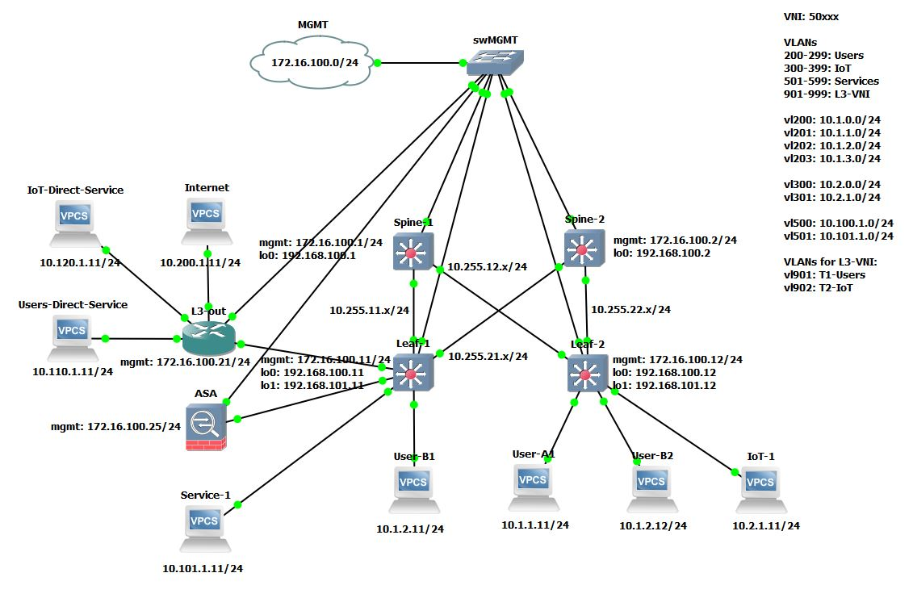
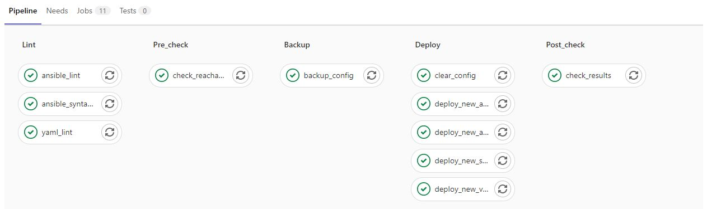
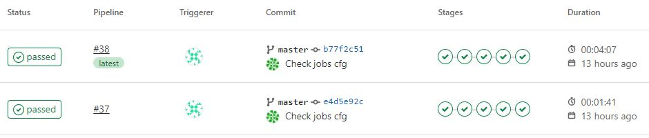

<!--
Cisco BGP EVPN VXLAN lab with Ansible automation
-->

# Cisco BGP EVPN VXLAN with Ansible automation

<!-- TABLE OF CONTENTS -->
## Table of Contents
#### 1. [About the project](#about-the-project)
#### 2. [GNS3 lab topology](#gns3-lab-topology)
#### 3. [Usage](#usage)
#### 4. [CI/CD](#cicd)

## About the project
This project pursues two main goals: 
- Get hands-on experience with BGP EVPN VXLAN: building spine-leaf fabric, implement service insertion (firewall) and L3 out with VRF
- Practice Ansible automation with Jinja2 templates and filters

The lab was built with GNS3. Ansible was installed on Ubuntu 20.04 virtual server. The same server was used as GitLab repository, and gitlab-runner was hosted on the same server to provide CI/CD pipeline (not the best practice but I prefered to save RAM and used only one Linux virtual server for all purposes).

## GNS3 lab topology

Software versions:
- Spine-1, Spine-2, Leaf-1, Leaf-2: nxosv-final.7.0.3.I7.7
- L3-out: csr1000v-universalk9.16.12.03
- ASA: asav984-15

***During multiple tests I defined reduced size of RAM for appliances that keeps their work still stable:***
- NXOSv: 6144MB
- CSR1kv: 2176MB
- ASAv: 1536MB

Configurations of all devices are in folder _/network_configs_.

## Usage
I divided the configuration process of all devices into four stages:
1. Manual initial configuration
2. Automated initial configuration
3. Manual operational configuration
4. Automated operational configuration

Every device should pass through Stage #1 to get configuration of management interface and credentials. 

Stage #2 is available only for fabric switches (spine and leaf). Their config is built from templates and then it is pushed to devices. Plays for Stage #2 (spine_init.yml, leaf_init.yml) use dedicated inventory file _init_inventory.yml_ that should be passed as parameter to play. This is a protection measure to prevent rewrite working configuration with initial for fabric switches in production. Then you should use plays _add_new_spine.yml_ and _add_new_leaf.yml_ to add configuration of new fabric switches to other switches that are in production already.

Router **L3-out** and firewall **ASA** get the most part of their configuration manually on the Stage #1. 

Stage #3 consists of manual configuration during operation. Such configuration is too custom to be automated. This configuration is made on **L3-out** (all configuration of **L3-out** is manual) and on **ASA** (configuration of ***network object groups*** is automated, the rest is manual). Also, some manual configuration is made on **Leaf-1** that is treated as "out leaf" and its configuration differs from other leaf switches.

Stage #4 consists of automated operational configuration of BGP EVPN VXLAN on all leaf switches and automated configuration of network object groups on firewall. 

## CI/CD
CI/CD pipeline is automated with GitLab. Jobs are following:

To save time some deploy tasks can be switched off in configuration file _cicd_jobs_cfg.yml_. For example, if you don't need to create new service but only connect new host to existed service, you should enable only access configuration with set ACC_CFG variable to "1" and rest variables to "0". You may see the difference in run time on the screenshot:

